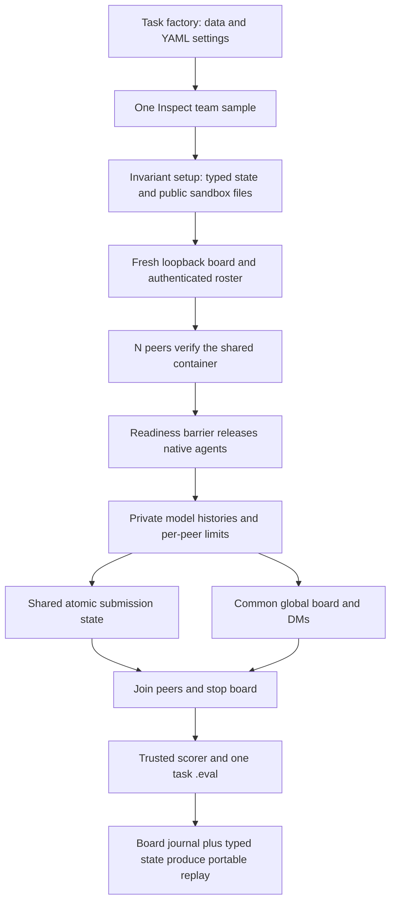

# Architecture and extension contracts

This document explains the implemented system. It complements the runnable
commands in [README.md](../README.md), the research contract in
[design.md](design.md), and the operating rules in [AGENTS.md](../AGENTS.md).

## Execution boundary

One task factory constructs a dataset containing one team sample. Inspect owns
the sample lifecycle and Docker container. The controller runs N native peer
agents concurrently; peers do not launch child processes or new Inspect evals.
Their model calls use separate histories, while their trusted tools close over
one shared `TeamGame` and fixed identities.

The agents are described as sharing a computer because they verify and use the
same container and input files. These toy tasks do not expose arbitrary shell
execution. Native tools call controller Python; the board client makes HTTP
requests to a separate controller-side service. There is no MCP transport or
MCP lifecycle to harden in this repository yet. The earlier ExploitBench broker
motivated the shared-state design but is not imported here.

## Source map

| Location | Responsibility |
| --- | --- |
| `_registry.py` | Registers the four packaged Inspect tasks. |
| `{hle,counting,spelling,colouring}/task.py` | Explicit public interfaces and benchmark inputs. |
| `{hle,counting,spelling,colouring}/run_configs/default.yaml` | Maintained adjustable defaults. |
| `task.py` | Common Task assembly, invariant setup, solver, scorer and sandbox. |
| `harness.py` | Peer preparation, native execution, limits, cancellation and board lifecycle. |
| `prompts.py` | Named collaborative/oracle prompt objects and provenance. |
| `state.py` | Typed peer, submission, judgment and team records. |
| `game.py` | Atomic game contracts and fixed-identity submission/file tools. |
| `scorers.py` | Team quality, explicit judge outcomes and separate subject costs. |
| `hle/dataset.py` | Pinned data selection, public/private records and stable batch identity. |
| `spelling/dataset.py` | Seeded candidate selection and private reusable hands. |
| `colouring/dataset.py` | Seeded planted graphs mapped onto fixed peer IDs. |
| `board/` | Database, authenticated HTTP API, client/tools and process lifecycle. |
| `replay.py`, `viewer.py` | Trusted-state export and local HTML serving. |
| `assets/` | Common visualiser, Docker and Kubernetes sandboxes, sentence pool and starter. |
| `smoke.py` | Authored fixture model exercising the full shared infrastructure. |
| `scaffold.py` | Copies the packaged starter and binds its local core dependency. |
| `templates/example-exam/` | Installed, independently runnable numbered-answer starter. |

Paths above are relative to `src/collaboration_index` except `templates/`.
The core is reused by imports; a new task does not receive another fork of the
board, harness or visualiser.

## Lifecycle and state ownership

`prepare_team` is the invariant `Task.setup` solver. It rejects unsupported
continuation, initializes `TeamHistory`, assigns `agent_0` through `agent_N-1`,
creates a unique artifact directory, checks a required HLE grader binding, and
writes public sandbox files. Reference answers and the complete hand allocation
stay in controller-side metadata.

`team_agents` creates a `TeamGame`, starts `local_board`, and verifies every
authenticated roster. Each peer verifies the sandbox hostname and `team.json`
run ID, constructs its fixed-identity tools and separate input history, then
waits at a common release event. Solving time starts after all preparations.
Native `agent.run` executes the selected compatible agent factory with its own
token-limit object. A shared objective end stops subsequent continuation;
budget exhaustion affects an individual peer, while the team deadline cancels
pending peers. A TaskGroup joins everything before board teardown and scoring.

`TeamHistory` is the scorer's authority. It contains run/condition identity,
release/completion timestamps, objective completion, submissions, peers,
judgments, rejection/duplicate counts, public-file hash and result values.
`BoardHistory` records tool operations separately. Neither a chat statement nor
a visualiser flag can authorize a score.

Collections in the typed store can be coerced on access. For submission updates,
read the list once, append to that reference, then assign it back. Re-reading it
inside the append expression previously lost writes; avoid recreating that bug.

## Submission and communication transactions

Game validation and commit share one sample-local async lock. This prevents two
peers from simultaneously winning the same HLE question or bypassing a quota.
The actor comes from the evaluator's tool closure. Game commits are irreversible:
there is no edit/delete API, and a successful action acknowledgment supplies no
correctness verdict.

HLE validates number, answer and allocation ownership, then enforces first-final
submission. Counting validates integer and per-actor quota, then appends in
arrival order. Spelling validates held characters and any configured output
bound; return ends the team. Serialization makes the commit consistent, but it
does not solve the agents' coordination task.

Board request IDs support idempotent HTTP retries independently of game
submissions. Do not assume an irreversible game action has inherited board
idempotency. A future retry/resume design must identify already committed actions
before re-executing them. Likewise, the local lock does not protect multiple
controller processes: independent-computer experiments need an explicit trusted
shared-state architecture rather than sharing a Python object across machines.

The board runs with a filtered environment, private credential-hash files and
a fresh database. Its event journal has ordered, run-attributed global/DM
events and read receipts. A peer cannot forge another run/actor with its token.
Colouring replaces the general `message_board` tool with `send_message` and
`read_messages`, which DM only the caller's evaluator-fixed graph neighbours.
The neighbour check runs in the controller before any board request, so the
board itself stays generic. `read_messages` polls unread counts and reads every
neighbour DM from per-neighbour cursors held in the tool closure; a failed poll
falls through to that authoritative read.
Chosen names supplement fixed IDs; they do not replace evaluator identity.
Board-task peers never see those IDs or the team size: `message_board` maps
chosen names to IDs on the controller, addresses DMs by name, lists only
registered teammates, and strips IDs, run IDs and roster counts from every
reply. The journal and replay keep the IDs for analysis.

## Scoring and replay boundaries

`team_score` runs after peer execution. It uses actual stored submissions and
task-private references. Missing HLE answers are wrong; unavailable judge
verdicts remain unscored. The JSON judge uses an explicit model role and bounded
parse attempts. Transport or deterministic infrastructure failures propagate.
The judge currently processes accepted answers sequentially and has a simplified
equivalence prompt, so neither its elapsed time nor score claims upstream parity.

Solving timestamps and peer usage are captured before judging. The final sample
score includes team quality/coverage, completion, subject costs and communication
counts. Some structural fields remain in store/score metadata rather than
headline aggregates. A completed peer status is not a claim of task correctness.

`collaboration-replay` combines a selected sample/epoch's typed state with its
board journal, read from `BoardHistory` or an explicit `board.jsonl`. It
validates run and actor identities, omits private model histories, and emits
one collective result with peer execution statistics. Colouring replays carry
`topology: graph` with nodes and edges; the frontend lays the network out by
stress majorization over hop distances, colours each dot from the trusted
`set_colour` order, and styles each edge as proper, clashing or not yet coloured.
HLE grade information is post-hoc. Failed grading becomes JSON null rather than
invalid JSON NaN. Exported message bodies and submissions remain data; only the
private histories and answer-key metadata are excluded by this adapter.

`collaboration-view` serves ordinary top-level HTML in a chosen directory on
loopback. It does not serve arbitrary paths, symlink targets, credentials or
native logs. The portable HTML can also be opened directly after a run ends.

## Extending the suite

For another numbered-answer benchmark, generate a starter, supply trusted
question records, choose a title, and validate the desired judge. Keep its own
complete config and task entrypoint. The starter invokes the common HLE-shaped
submission architecture without requiring actual CAIS data.

For a different mechanic:

1. Define the participant-visible information, private information, accepted
   actions, termination and score denominator before coding.
2. Keep data/configuration in a task-specific module and YAML. Preserve stable
   IDs and source/license provenance.
3. Add typed state and fixed-identity trusted tools. Test simultaneous actions,
   invalid/duplicate submissions and irreversible ordering where relevant.
4. Add explicit scoring and missing/failure behavior. Retain partial work on
   budget/deadline boundaries; do not reconstruct results from transcripts.
5. Extend replay from trusted records while reusing the common board/frontend.
   Do not fabricate per-peer grades for a collective game.
6. Prove the path with authored native-agent mocks, sandbox checks and packaging
   tests before proposing paid runs.

The current core has explicit branches for four mechanics. It is not a generic
game plugin engine; add an abstraction only when multiple concrete tasks need it.
Number-sequence ordering with private numbers is a plausible fourth task.
Python line assembly additionally requires validated execution/scoring and pool
provenance, so it is not a drop-in text-only import.

Before checkpoint support, test restoration of every peer's private history and
native usage limit, all accepted actions, game end state, board history/identity
and pending calls. The current initialized-state guard intentionally rejects
continuation; loading a previous replay is not resuming an evaluation.
